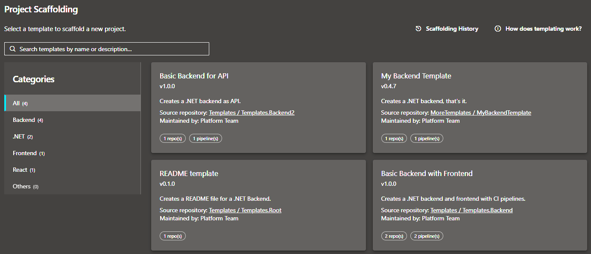

# Azure DevOps Project Scaffolder

An Azure DevOps extension that lets project administrators bootstrap repositories and pipelines from reusable, parameterized templates.



## What it does

Templates are ordinary Git repositories. Drop a `project-template.yml` at the root, put your boilerplate files in subfolders, and the extension discovers the template automatically via the built-in Code Search of Azure DevOps. Users only see templates in projects they have access to, and the extension checks permissions before attempting to create anything.

When someone opens **Project Settings → Project Scaffolding**, they see all the accessible templates where they can pick the one they need and fill in a parameter form. The extension then creates repositories and registers YAML pipelines in a single orchestrated run, based on the template and the parameterized configuration.

Everything is non-destructive. If a repository already exists and has commits, it is left alone. Anything the user is not permitted to create is skipped cleanly rather than erroring out.

## Features

- **Automatic template discovery** — Templates are discovered automatically from all repositories in the collection that contain a `project-template.yml` file. No manual registration required.
- **Parameterized templates** — Templates declare typed parameters (string, boolean, choice) with optional validation, hints, and conditional visibility rules. Repository names, file paths, and file contents are all rendered through Handlebars.js.
- **Conditional resources** — Entire repositories or pipelines can be skipped based on parameter values, keeping templates flexible without forking.
- **Guided progress UI** — A step-by-step progress view shows which repositories and pipelines are being created, with clear success and error indicators.
- **Non-destructive execution** — Existing repositories with content are never modified. The extension creates only what is missing.
- **Template categories** — Organization administrators can define categories to group and filter templates, making large template libraries easy to navigate.
- **Project restriction** — Administrators may restrict which project's templates are offered to users, enabling centralized governance of the template library.
- **Admin hub** — A dedicated settings page gives organization / collection administrators control over categories and project restrictions.

## Getting started

### 1. Install the extension

Install [**Project Scaffolder** from the Visual Studio Marketplace](https://marketplace.visualstudio.com/items?itemName=namoshek.ado-project-scaffolder) into your Azure DevOps organization.

### 2. Make sure Code Search is enabled

The extension uses the Code Search API to find `project-template.yml` files across the collection. If Code Search is not installed, template discovery will not work.

### 3. Create a template

Create a new repository in any project and add `project-template.yml` to its root:

```yaml
id: "04bd1234-5678-90ab-cdef-1234567890ab" # use a random UUID and never change it
name: "My Service Template"
version: "1.0.0"
description: "Creates a backend service with a CI pipeline."

parameters:
  - id: projectName
    label: "Project Name"
    type: string
    required: true
    validation:
      regex: "^[a-z][a-z0-9-]+$"
      message: "Lowercase letters, numbers, and hyphens only."

repositories:
  - name: "{{projectName}}.backend"
    sourcePath: "templates/backend"
    defaultBranch: "main"

pipelines:
  - name: "{{projectName}}-ci"
    repository: "{{projectName}}.backend"
    yamlPath: "pipelines/ci.yml"
    folder: "\\CI"
```

Place your template files under `templates/backend/`. File names and file contents both support Handlebars expressions.

Code Search indexes new files within a few minutes. Once indexed, the template appears in **Project Settings → Project Scaffolding** for any project in the collection (subject to admin restrictions and access permissions).

## Template authoring

The full schema reference and authoring guide, including `when` expressions, file exclusions, pre/post scaffold notes, and binary file handling, is in [docs/template_authoring.md](docs/template_authoring.md).

A thorough example template can be found in [examples/project-template.yml](examples/project-template.yml).

## Admin configuration

Organization administrators have a **Project Scaffolding** page under **Organization Settings** with two settings:

- **Template categories:** define the category names available to template authors. Templates are grouped by category in the selection UI; an _All_ tab and an _Uncategorized_ fallback are always present.
- **Project restriction:** optionally pin template discovery to one or more projects. Useful when you maintain a dedicated "templates" project and want to prevent ad-hoc templates from appearing organization-wide.

## Permissions

All API calls are made directly from the browser using the signed-in user's OAuth token. There is no server-side component or service principal.

The extension requests these OAuth scopes:

| Scope               | Purpose                                                                  |
| ------------------- | ------------------------------------------------------------------------ |
| `vso.code_manage`   | Required to read template files and create repositories                  |
| `vso.build_execute` | Required to read and create YAML pipeline definitions                    |
| `vso.agentpools`    | Required to read agent queues for pipeline registration                  |
| `vso.project`       | Required to read project list (used in the admin restriction dropdown)   |

## Development

### Build

```sh
npm install
npm run build
```

### Run linter & tests

```sh
npm run lint
npm run test
```

### Package the extension

```sh
npm run package
```

This produces a `.vsix` file that can be uploaded to the Marketplace or installed directly into an Azure DevOps Server instance.

### Development Resources

- [Azure DevOps Design System](https://developer.microsoft.com/en-us/azure-devops/)

## License

The MIT License (MIT). Please see [License File](LICENSE.md) for more information.
